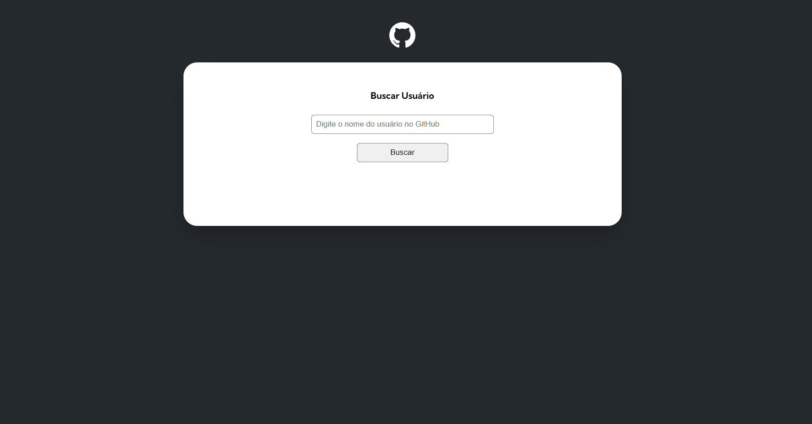

# Quest de JavaScript Avançado

Quest do curso DevQuest, dos irmãos Ricardo e Roberto (<a href="https://www.instagram.com/devemdobro" target="_blank">@devemdobro</a>).

## Prévia

## Tecnologias utilizadas

- HTML
- CSS
- JavaScript

## Aprendizados

- Import e Export (módulos JavaScript);
- Fetch API;
- Async e Await;
- Promises.

## Dificuldades encontradas

tive um leve bloqueino na parte de buscar as mensagens dos eventos na API, acontecia um erro quando tentava acessar uma array dentro de outra array pra buscar um objeto especifico, quando fazia o caminho e tentava acessar o indice da ultima array retornava undefined e retornava um erro, a solução que encontrei na fonte :https://javascript.plainenglish.io/javascript-cannot-read-property-0-of-undefined-22d41b4e6f12, foi usar 
operador de encadeamento opcional (?.) que retorna indefinido em vez de tentar acessar a propriedade e causar um erro.